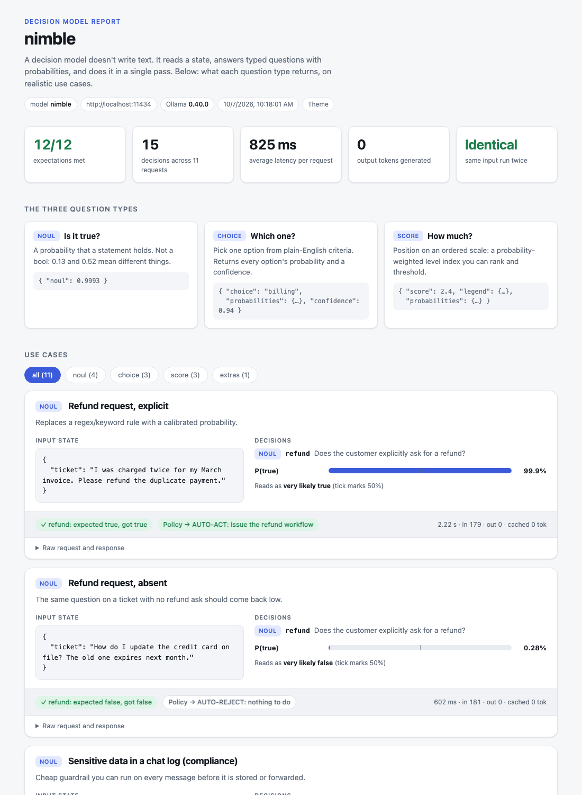
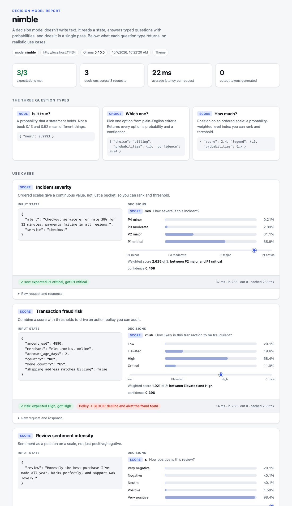

## nimble decision-model demo

`nimble_demo.py` runs realistic use cases against the local `nimble` decision model
(`POST /v1/systemone` on Ollama) for each question type: `noul`, `choice` and `score`.
It also runs a multi-question call, a determinism check and threshold-based policies.

By default it writes a self-contained HTML report (`reports/nimble-report.html`, built from
`report_template.html`) and opens it in your browser. Each case shows the input state, the
probability distribution, expected vs actual, the policy action, latency/token stats and the
raw request/response.

### Sample output



Ordered `score` questions show the distribution plus a marker for the weighted score, and
policies (here, fraud risk -> block) are applied on top:



The full report from a real run is saved as [`docs/sample-report.html`](docs/sample-report.html)
(download it and open it in a browser; it is a single self-contained file).

```sh
uv run nimble_demo.py                    # HTML report, opened in the browser
uv run nimble_demo.py --no-open          # write the report without opening it
uv run nimble_demo.py --out my.html      # choose the report path
uv run nimble_demo.py --console          # print to the terminal instead
uv run nimble_demo.py --console --verbose  # ...with raw request/response JSON
uv run nimble_demo.py --only choice      # noul | choice | score | extras
uv run nimble_demo.py --json out.json    # also dump results as JSON
```

Requires Ollama >= 0.40 running with the `nimble` model installed. The first call can be
slow while the model loads.
